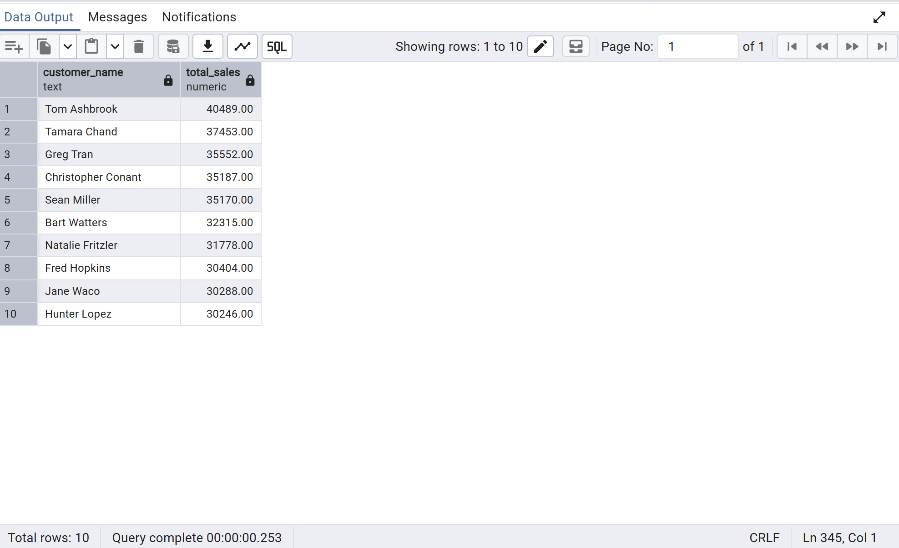
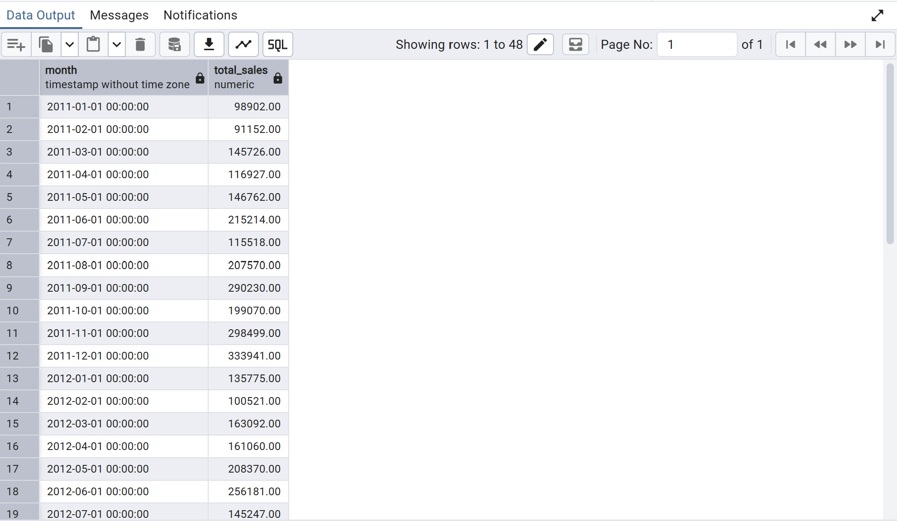
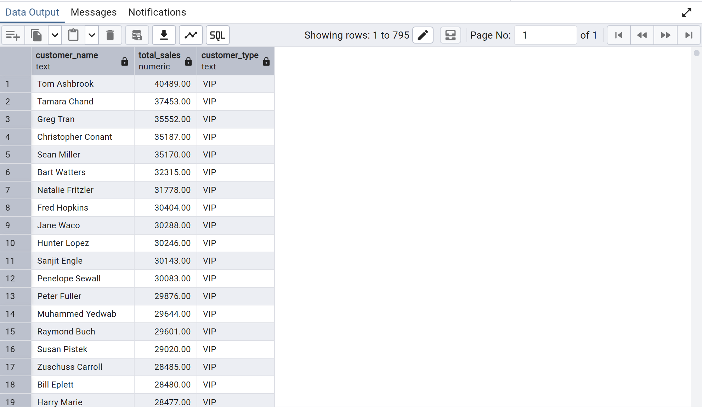
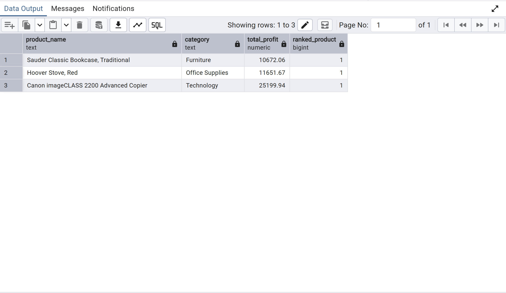

# Superstore SQL Analysis Project

## Project Overview

This project analyzes retail sales data using PostgreSQL.  
The original Superstore dataset was imported, cleaned, and transformed into a relational database structure.

The goal of this project is to answer business questions related to sales, profit, customers, products, shipping, and regional performance using SQL.

## Tools Used

- PostgreSQL
- pgAdmin 4
- SQL
- GitHub

## Dataset

The project uses the Global Superstore dataset, containing over 50,000 retail transaction records.

## Database Structure

The original dataset was divided into three relational tables:

### customers
Contains customer-level information:
- customer_id
- customer_name
- segment
- region
- market

### products
Contains product-level information:
- product_id
- product_name
- category
- sub_category

### order_details
Contains transaction-level information:
- order_id
- order_date
- ship_date
- customer_id
- product_id
- sales
- profit
- quantity
- discount
- shipping_cost
- ship_mode
- order_priority

## SQL Skills Demonstrated

- Data cleaning
- Data type conversion
- JOINs
- LEFT JOIN
- Aggregations
- GROUP BY
- CASE WHEN
- CTEs
- Window functions
- RANK()
- PARTITION BY
- LAG()
- DATE_TRUNC()
- Running totals
- Customer segmentation
- Profit margin analysis

## Business Questions Answered

### Sales Analysis
- What is the total revenue?
- What is the monthly sales trend?
- What is the running monthly sales total?
- What is the average order value?

### Profit Analysis
- Which categories are most profitable?
- Which regions have the highest profit margin?
- Which products generate the highest profit?

### Customer Analysis
- Who are the top customers by sales?
- Which customers are VIP, Regular, or Small?
- What is each customer’s favorite shipping method?
- Who is the top customer in each segment?

### Product Analysis
- Which products generate the most profit?
- What is the most profitable product in each category?
- Which products were never ordered?

## Key Insights

- Sales and profit performance vary significantly by category and region.
- Some regions generate strong sales but lower profit margins.
- A small number of customers contribute a large share of total revenue.
- Shipping mode analysis helps identify operational cost patterns.
- Window functions help identify top-performing products and customers within each group.

## Repository Files

- `schema.sql` — creates relational tables from the cleaned dataset
- `data_cleaning.sql` — converts imported text data into proper data types
- `business_questions.sql` — contains core business analysis queries
- `advanced_analysis.sql` — contains CTEs, window functions, rankings, and advanced analysis
- `screenshots` — query result screenshots

## Project Screenshots

### Database Tables

### Top Customers by Sales

### Monthly Sales Trend

### Customer Segmentation

### Most Profitable Product per Category

## Author

Melika Hamedani
